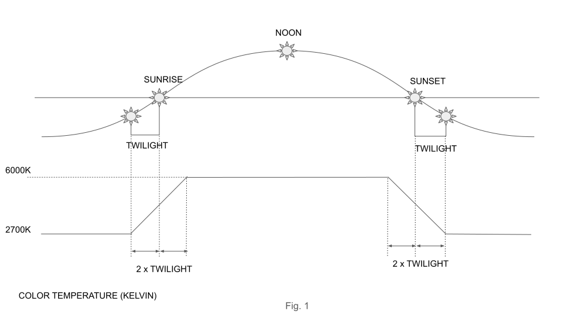

# homework-back-end
Technical interview homework assignment for back-end developers

# NightTimeTemperature Microservice

Implement NightTimeTemperature microservice, which determines colour temperature of the screen according to current position of the sun. Calculate temperature in Kelvins according to Fig. 1

Implement a GET request with the following parameters:
- lat (float): Latitude in decimal degrees. Required.
- lng (float): Longitude in decimal degrees. Required.

## Sample request
localhost:8080/night-time-temperature?lat=43.66258321585993&lng=-79.39152689466948

## Response
{
“temperature”:3400
}

## Implementation
- Use https://start.spring.io/ to create Gradle Project for Java or Kotlin;
- Use https://sunrise-sunset.org/api for determining sunrise/sunset/twilight;
- Create Dockerfile to run microservice as a Docker container;
- Add JUnit **integration** tests to verify correctness of service execution (test should be executed using Gradle integrationTest task, see https://docs.gradle.org/current/userguide/java_testing.html#sec:configuring_java_integration_tests);
- Create Service Virtualisation to mock sunrise-sunset.org API using [WireMock](http://wiremock.org/);
- WireMock should run as a Docker container as well - use https://hub.docker.com/r/rodolpheche/wiremock/;
- Provide two Spring Boot profiles - dev and qa. Dev profile should use WireMock and qa profile should use real sunrise-sunset.org service;
- Use docker-compose to define and run NightTimeTemperature service and WireMock containers together;

Please provide instructions on how to build, run, and execute integration tests in the following section.

## Execution Instructions

> **Note:** Please provide instructions here \
> I was having issue with gradle-java while running on local that's why followed the maven-java way for coding.
1. for wiremock please do following (I did that as this was not working https://hub.docker.com/r/rodolpheche/wiremock/):
	a. downloaded the wiremock-standalone-3.3.1.jar from http://wiremock.org/
	b. run the jar with command
		java -jar wiremock-standalone-3.3.1.jar --port 9911
	c. create mock/stub url with following curl:
		curl --location 'http://localhost:9911/__admin/mappings' \
			--header 'Content-Type: application/json' \
			--data '{
				"request": {
					"method": "GET",
					"urlPattern": "/wiremocked/json.*"
				},
				"response": {
					"status": 200,
					"headers": {
						"Content-Type": "application/json"
					},
					"jsonBody": {
						"results": {
							"sunrise": "7:27:02 AM",
							"sunset": "5:05:55 PM",
							"solar_noon": "12:16:28 PM",
							"day_length": "9:38:53",
							"civil_twilight_begin": "6:58:14 AM",
							"civil_twilight_end": "5:34:43 PM",
							"nautical_twilight_begin": "6:25:47 AM",
							"nautical_twilight_end": "6:07:10 PM",
							"astronomical_twilight_begin": "5:54:14 AM",
							"astronomical_twilight_end": "6:38:43 PM"
						},
						"status": "OK",
						"tzId": "UTC"
					}
				}
			}'
	d. check if everything stub is working or not with following curl
		curl --location 'http://localhost:9911/wiremocked/json?lat=43.66258321585993&lng=-79.39152689466948'

2. please extract the zip file attached with email		
3. now change directory to codeassessmentexercise
4. I am assuming docker is installed then run following commands:
	a. docker build --build-arg JAR_FILE=/target/codeassessmentexercise-0.0.1-SNAPSHOT.jar -t codeassessment/myapp .
	b. docker run -p 8080:8080 codeassessment/myapp
	c. after successful run please check with following curl
		curl --location 'http://localhost:8080/night-time-temperature?lat=43.66258321585993&lng=-79.39152689466948&tzId=Asia%2FBahrain'
	